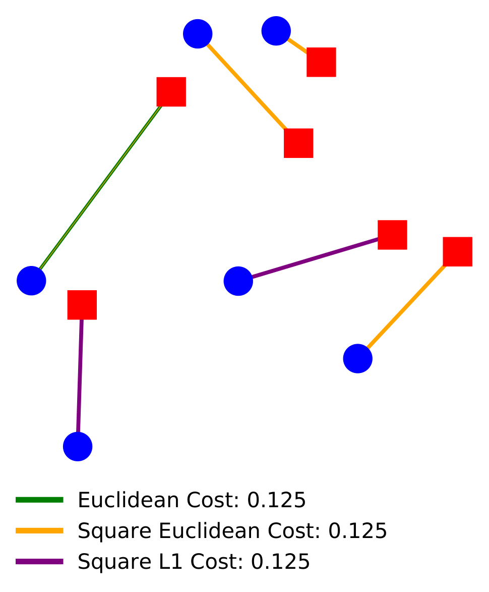
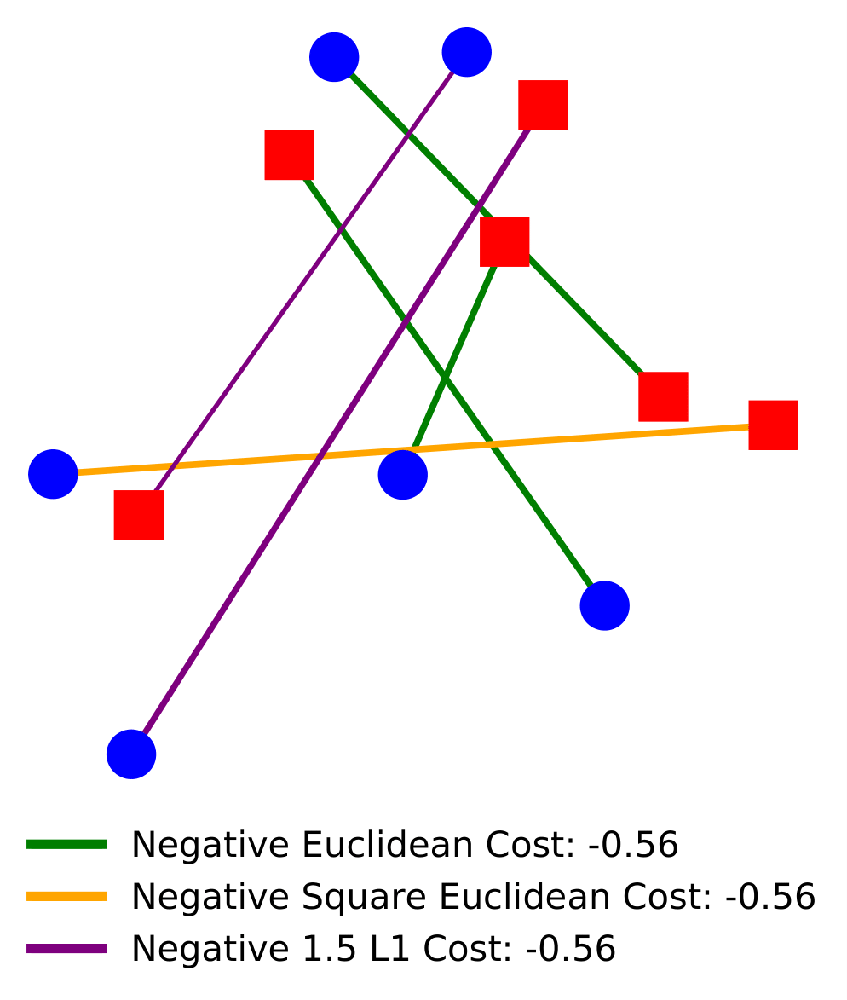

# Equitable and Optimal Transport
Code of the [paper](https://arxiv.org/pdf/2006.07260.pdf) by Meyer Scetbon, Laurent Meunier, Jamal Atif and Marco Cuturi.

## A New Fair Optimal Transport Problem Between Multiple Agents
In this work, we introduce an extension of the Optimal Transport, namely the Equitable Optimal Transport (EOT) problem, when multiple costs are involved. Considering each cost as an agent, we aim to share equally between agents the work of transporting one distribution to another. In the following figures, we illustrate how our method split the transportation task between 3 given agents. In the left figure, we illustrate a case where each agent aims at miniziming its total transporation cost while in the right one, we consider a case where each agent aims at maximizing its utlity (viewed as a negative cost).

   
\
\
\
\
\
\
\
\
\
\
\
\
\
\
\
\
\
To be able to compute EOT, we propose to regularize it by adding an entropic term to the objective. Such regularization leads to a Sinkhorn-like algorithm which manages to compute efficiently an approximation of EOT. In this [file](https://github.com/meyerscetbon/EOT/blob/main/toy_example.py) we provide some toy examples where we compare our Sinkhorn-like algorithm with a projected gradient descent one and with a standard linear programming solver.

This repository contains a Python implementation of the algorithms presented in the [paper](https://arxiv.org/pdf/2006.07260.pdf).
